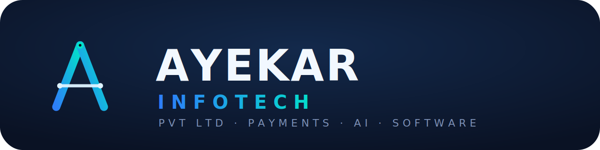

<div align="center">



# Karan D. Thanage — Digital CV

**Founder & CEO, Ayekar Infotech** · Web Developer · Cybersecurity Specialist (CEH · CRTP)

A single-page, self-hosted resume site — terminal-boot hero, 3D-tilt portrait card,
live particle-network background, and a git-commit-styled experience log.

[](#)
[](#)
[](./LICENSE)
[](#)

</div>

---

## Overview

This repository powers the personal site of **Karan Daulat Thanage** — a resume
built as a real piece of software rather than a static document. It presents
his ventures (Ayekar Infotech, GoVerifAI, KaakaPOS), technical arsenal,
experience log, and certifications through a dark, terminal-inspired interface
with deliberate motion design.

No frameworks, no build step: pure HTML, CSS, and vanilla JavaScript.

## Highlights

| Feature | Description |
|---|---|
| 🖥️ Terminal hero | Boot-sequence typing animation introducing identity |
| 🧊 3D portrait card | Cursor-reactive tilt, rotating gradient ring, scan-line effect |
| 🌐 Particle network | Ambient animated canvas background, connection-graph style |
| 📊 Animated counters | Impact metrics count up into view on scroll |
| 🃏 Tilt cards | Venture cards respond to cursor position in 3D space |
| 🧬 Commit-log timeline | Career history rendered as a git log, branch-per-venture |
| ♿ Accessible by default | Respects `prefers-reduced-motion`, visible focus states, disables tilt on touch |

## Structure

```
index.html              site markup, styles, and scripts (single file)
assets/logo.png          Ayekar Infotech wordmark — nav + favicon
assets/portrait.jpg       profile portrait — hero
Karan_Thanage_CV.pdf      downloadable résumé, linked from hero CTA
LICENSE                  copyright notice
```

Keep `assets/` alongside `index.html` — image paths are relative.

## Deployment — GitHub Pages

```bash
git init
git add .
git commit -m "Deploy: digital CV"
git branch -M main
git remote add origin https://github.com/<your-username>/<repo-name>.git
git push -u origin main
```

Then: repo → **Settings → Pages** → Source: **Deploy from a branch** → Branch `main`, folder `/ (root)` → **Save**.
Name the repository `<your-username>.github.io` if you want the site at the root of your GitHub domain rather than under `/repo-name/`.

## Connecting a DigitalPlat free domain

DigitalPlat issues free subdomains (e.g. `karanthanage.dpdns.org`). To point one at this site:

1. **GitHub side** — repo → **Settings → Pages → Custom domain** → enter your domain → **Save**. This commits a `CNAME` file to the repo root; don't remove it.
2. **DNS side** — in the DigitalPlat DNS panel, add:

   | Type | Host | Value |
   |---|---|---|
   | CNAME | `@` (or your subdomain host) | `<your-username>.github.io` |

3. Wait for propagation, then return to **Settings → Pages** and enable **Enforce HTTPS**.

Check propagation anytime:
```bash
dig +short karanthanage.dpdns.org
```

## Local preview

```bash
python3 -m http.server 8000
# → http://localhost:8000
```

## Copyright

© 2026 Karan Daulat Thanage / Ayekar Infotech Pvt Ltd. **All rights reserved.**

This is proprietary work — the code, design system, and content are not
licensed for reuse, forking, or redistribution. See [`LICENSE`](./LICENSE)
for full terms. For permissions or collaboration inquiries, reach out at
**ayekarinfotech@aol.com**.
